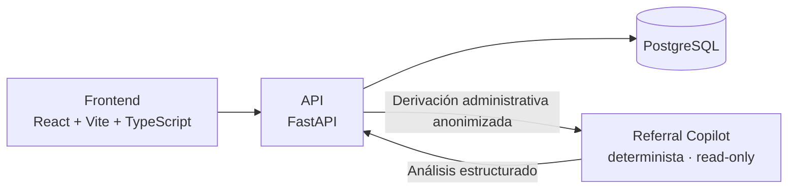
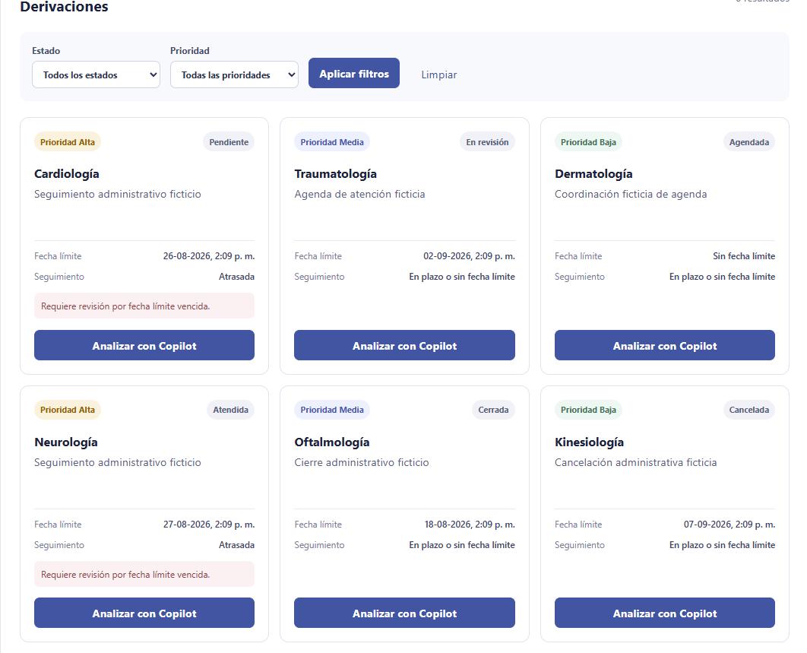
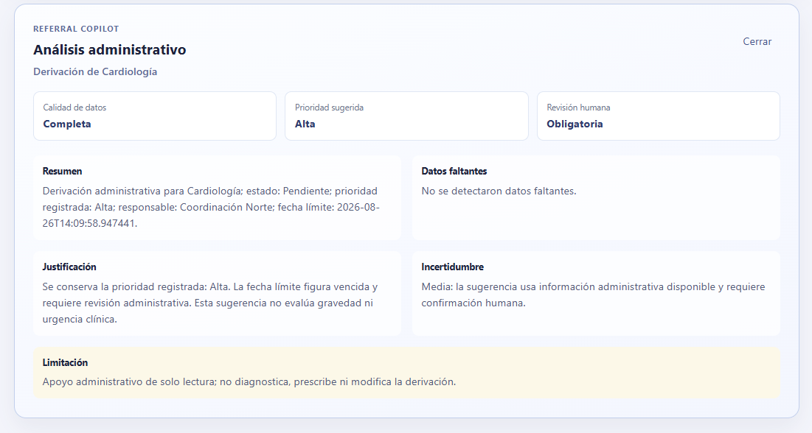

# HealthBridge

HealthBridge es un prototipo académico de gestión y trazabilidad de derivaciones clínicas. Su objetivo es organizar derivaciones y entregar apoyo administrativo seguro para su revisión; no es un sistema clínico productivo ni reemplaza las decisiones de profesionales de la salud.

El proyecto utiliza exclusivamente datos ficticios y está orientado a aprendizaje y portafolio en Informática Biomédica.

## Funcionalidades implementadas

- Gestión persistente y consulta de pacientes y derivaciones.
- Filtros combinables de derivaciones por estado, prioridad, especialidad, RUT del paciente y condición de atraso.
- Indicadores operativos de volumen, estados, prioridad alta y derivaciones atrasadas.
- Historial de cambios de estado por derivación.
- Persistencia con PostgreSQL, SQLAlchemy 2.x y migraciones Alembic.
- Pruebas aisladas con SQLite temporal y datos ficticios generados por fixtures.
- Referral Copilot determinista, administrativo y de solo lectura.
- Frontend separado construido con React, Vite y TypeScript para consultar derivaciones e iniciar el análisis del Copilot.

## Seguridad y límites del Referral Copilot

El Referral Copilot es una ayuda administrativa; no es una herramienta de diagnóstico ni de decisión clínica.

- Recibe únicamente datos administrativos anonimizados de una derivación.
- No acepta ni devuelve RUT, nombre ni `paciente_id`.
- No diagnostica, prescribe ni infiere gravedad clínica.
- No modifica pacientes, derivaciones, estados ni historial.
- Siempre devuelve `requiere_revision_humana=true`.
- Actualmente funciona con reglas deterministas internas: no utiliza IA generativa, OpenAI ni un LLM.

## Arquitectura



## Capturas de la interfaz



*Dashboard con datos ficticios de demostración*.



*Resultado administrativo y de solo lectura del Referral Copilot*.

## Stack tecnológico

- Backend: Python, FastAPI y Pydantic.
- Persistencia: PostgreSQL, SQLAlchemy 2.x y Alembic.
- Pruebas: pytest, httpx y SQLite temporal en memoria.
- Frontend: React, Vite y TypeScript.

## Ejecución local en Windows

Se requiere contar con PostgreSQL local configurado y un archivo `.env` local basado en `.env.example`. No publiques ese archivo ni sus credenciales.

Desde la raíz del repositorio, activa el entorno virtual reparado e instala las dependencias de backend:

```powershell
& .\.venv-repaired\Scripts\Activate.ps1
& .\.venv-repaired\Scripts\python.exe -m pip install -r requirements.txt
```

Inicia la API:

```powershell
& .\.venv-repaired\Scripts\python.exe -m uvicorn backend.main:app --reload
```

En otra terminal, instala y levanta el frontend:

```powershell
cd frontend
npm.cmd install
npm.cmd run dev
```

URLs locales:

- Swagger UI: `http://127.0.0.1:8000/docs`
- Frontend: `http://localhost:5173`

## Pruebas

Ejecuta la suite desde la raíz del proyecto:

```powershell
& .\.venv-repaired\Scripts\python.exe -B -m pytest -q -p no:cacheprovider
```

Las pruebas usan una base SQLite temporal aislada, datos ficticios sembrados por fixtures y no utilizan la base PostgreSQL real ni su archivo `.env`.

## Integración continua

GitHub Actions ejecutará automáticamente las pruebas aisladas del backend y el build del frontend en cada `push` y `pull request`. El flujo no usa secretos, `.env`, PostgreSQL real ni servicios externos.

## Datos demo

La demostración local usa exclusivamente la base SQLite separada `sqlite:///./healthbridge_demo.db`; nunca utiliza la base PostgreSQL configurada para el proyecto. Aplica las migraciones Alembic antes de cargar datos ficticios con especialidades, estados, prioridades, responsables, historial, una derivación atrasada y otra sin fecha límite.

Para crearla desde la raíz del repositorio:

```powershell
& .\.venv-repaired\Scripts\python.exe scripts\seed_demo.py
```

El comando se niega a cargar datos si la base demo ya contiene registros. Para regenerar solamente el archivo local `healthbridge_demo.db`:

```powershell
& .\.venv-repaired\Scripts\python.exe scripts\seed_demo.py --reset
```

`--reset` rechaza PostgreSQL, URLs externas y otros nombres de archivo; borra únicamente los datos de demostración locales. La API actual se configura con PostgreSQL; para visualizar esta SQLite desde la API o el frontend se requerirá una configuración local explícita de URL de base de datos, que no forma parte de esta tarea. No copies estos datos a la base PostgreSQL normal.

## Ejecutar la demo completa

Desde la raíz del repositorio, crea los datos ficticios y define la URL temporal de la base demo antes de iniciar FastAPI:

```powershell
& .\.venv-repaired\Scripts\python.exe scripts\seed_demo.py
$env:DATABASE_URL = "sqlite:///./healthbridge_demo.db"
& .\.venv-repaired\Scripts\python.exe -m uvicorn backend.main:app --reload
```

`DATABASE_URL` solo afecta la terminal actual. Si no se define, HealthBridge conserva su configuración PostgreSQL habitual. Para volver a ella en la misma terminal, ejecuta `Remove-Item Env:DATABASE_URL` antes de iniciar la API.

## Endpoints principales

| Método | Ruta | Propósito |
| --- | --- | --- |
| `GET` | `/` | Verifica la disponibilidad de la API. |
| `POST` | `/pacientes` | Crea un paciente persistente. |
| `GET` | `/pacientes` | Lista pacientes. |
| `GET` | `/pacientes/{paciente_id}` | Consulta un paciente por identificador. |
| `GET` | `/derivaciones` | Lista derivaciones y admite filtros administrativos. |
| `POST` | `/derivaciones` | Crea una derivación para un paciente existente. |
| `GET` | `/derivaciones/{derivacion_id}` | Consulta una derivación por identificador. |
| `PATCH` | `/derivaciones/{derivacion_id}/estado` | Actualiza el estado y registra el movimiento en el historial. |
| `GET` | `/derivaciones/{derivacion_id}/historial` | Consulta el historial de estados cronológico. |
| `GET` | `/indicadores` | Entrega indicadores operativos calculados desde PostgreSQL. |
| `POST` | `/derivaciones/{derivacion_id}/copilot/analizar` | Genera un análisis administrativo, determinista y de solo lectura. |

La documentación interactiva y los contratos completos están disponibles en Swagger UI al ejecutar la API.

## Trabajo futuro

- Incorporar autenticación y auditoría de acceso y acciones.
- Aplicar anonimización adicional al texto libre antes de cualquier integración externa.
- Evaluar una integración opcional de LLM, desacoplada y sujeta a políticas de privacidad, costos, límites de uso y revisión humana obligatoria.
